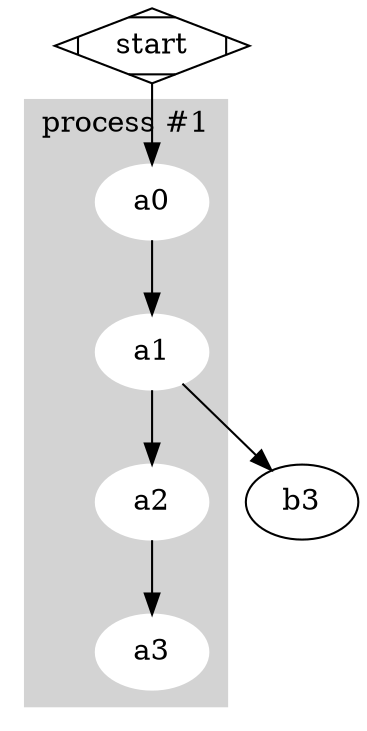

# Graphviz DOT

The language `dot`, `neato` and every "render me a graph" tool read - nodes,
edges and the attributes hung on both:



The whole grammar turns on the order of the alternatives in `Statement`. An
edge, an assignment and a node all begin with the same name, and only what
comes *after* that name tells them apart. Alternatives are tried in order and
the first one that fits wins, so `EdgeStatement` is written before
`Assignment` and both before `NodeStatement` - the other way round, `a0` would
be read as a node and the `-> a1` behind it would have nowhere to go.

Keywords have the same problem in the lexer, where the same rule applies:
`T_GRAPH` and friends are declared before `T_ID`, or `graph` would be read as
an identifier and never as a keyword.

## Grammar

```pp2
/**
 * -----------------------------------------------------------------------------
 *  Graphviz DOT
 * -----------------------------------------------------------------------------
 *
 * The language a graph is described in for Graphviz: the nodes, the edges
 * between them and the attributes of both.
 *
 * @see https://graphviz.org/doc/info/lang.html
 */

%pragma root Graph

%skip  T_WHITESPACE        \s++
%skip  T_COMMENT           //[^\r\n]*+|#[^\r\n]*+
%skip  T_DOC               /\*.*?\*/

%token T_STRICT            (?i)strict\b
%token T_GRAPH             (?i)graph\b
%token T_DIGRAPH           (?i)digraph\b
%token T_SUBGRAPH          (?i)subgraph\b
%token T_NODE              (?i)node\b
%token T_EDGE              (?i)edge\b

// A string is written across several lines by escaping the line break
%token T_STRING            "(?:[^"\\]|\\[\s\S])*+"
%token T_HTML_STRING       <(?:[^<>]|<[^<>]*+>)*+>
%token T_NUMBER            -?(?:\.[0-9]++|[0-9]++(?:\.[0-9]*+)?)
%token T_ID                [a-zA-Z\x{0080}-\x{FFFF}_][a-zA-Z\x{0080}-\x{FFFF}_0-9]*+

%token T_DIRECTED_EDGE     ->
%token T_UNDIRECTED_EDGE   --

%token T_BRACE_OPEN        \{
%token T_BRACE_CLOSE       \}
%token T_BRACKET_OPEN      \[
%token T_BRACKET_CLOSE     \]
%token T_SEMICOLON         ;
%token T_COMMA             ,
%token T_COLON             :
%token T_EQUAL             =

Graph
  : <T_STRICT>? (<T_GRAPH> | <T_DIGRAPH>) Id()?
    ::T_BRACE_OPEN:: StatementList() ::T_BRACE_CLOSE::
  ;

StatementList
  : (Statement() ::T_SEMICOLON::?)*
  ;

/**
 * An edge is read before a node, because both begin with the same name and
 * only an edge goes on past it.
 */
Statement
  : AttributeStatement()
  | Subgraph()
  | EdgeStatement()
  | Assignment()
  | NodeStatement()
  ;

// graph [...], node [...], edge [...]
AttributeStatement
  : (<T_GRAPH> | <T_NODE> | <T_EDGE>) AttributeList()
  ;

// rankdir = LR
Assignment
  : Id() ::T_EQUAL:: Id()
  ;

// a -> b -> c [color = red]
EdgeStatement
  : (Subgraph() | NodeId()) EdgeRight()+ AttributeList()?
  ;

EdgeRight
  : EdgeOperator() (Subgraph() | NodeId())
  ;

EdgeOperator
  : <T_DIRECTED_EDGE>
  | <T_UNDIRECTED_EDGE>
  ;

// a [shape = box]
NodeStatement
  : NodeId() AttributeList()?
  ;

// a, a:port, a:port:n
NodeId
  : Id() Port()?
  ;

Port
  : ::T_COLON:: Id() (::T_COLON:: Id())?
  ;

Subgraph
  : (::T_SUBGRAPH:: Id()?)? ::T_BRACE_OPEN:: StatementList() ::T_BRACE_CLOSE::
  ;

AttributeList
  : (::T_BRACKET_OPEN:: AttributeSet()? ::T_BRACKET_CLOSE::)+
  ;

AttributeSet
  : (Id() (::T_EQUAL:: Id())? (::T_SEMICOLON:: | ::T_COMMA::)?)+
  ;

Id
  : <T_ID>
  | <T_STRING>
  | <T_HTML_STRING>
  | <T_NUMBER>
  ;
```

## Usage

```php
use Phplrt\Compiler\Compiler;
use Phplrt\Source\File;

$parser = new Compiler()
    ->load(new File(__DIR__ . '/grammar.pp3'))
    ->getParser();

$graph = $parser->parse(new File(__DIR__ . '/cluster.dot'));
```

Three kinds of comment are thrown away by `%skip` - `//`, `#` and `/* ... */` -
and so is the whitespace that separates statements, since DOT is happy to have
its statements on one line or on twenty.

> **25+ more grammars.** [phplrt/grammars](https://github.com/phplrt/grammars)
> collects ready to read grammars for real languages - JSON5, TSV, semantic
> versions, DQL, PHQL, JMS types, PSR-5 and Doctrine annotations, Symfony
> expressions, Go! AOP pointcuts, Praspel contracts and more - each with sample
> inputs and a test that keeps it honest.
